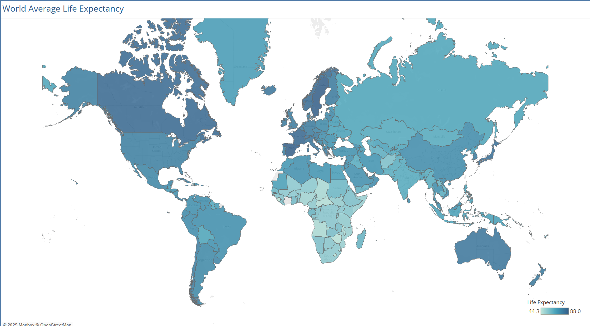

# World Life Expectancy

This project examines the average life expectancy in 193 countries around the world, for the years 2007 – 2022. Overall, life expectancy varies significantly across countries, as shown below.

Technical Details about the project can be found here: [Project Technical Details](#project-technical-details)

Average Life Expectancy by Country

- The live Tableau dashboard can be viewed here:
[Tableau Public](https://public.tableau.com/app/profile/scott.solik/vizzes)

## Life Expectancy Trends

- The worldwide average life expectancy has incresed from **66.8 years in 2007** to **71.6 years in 2022**, representing a **7.2% increase**.
- A noticable dip in the global life expectancy occurred in **2020** as a result of the COVID-19 pandemic.
- **Haiti** experienced the largest change in life expectancy from 2007 to 2022, from **36.3 to 65 years**.
  
  - Other countries, such as Zimbabwe, Eritrea, and Uganda, have also seen significant increases in life expectancy, suggesting positive health and economic development.
- The following countries are tied for the highest life expectancy, at **89 years:** Sweden, Italy, Germany, France, Portugal, New Zealand, Finland, Norway, Spain, and Belgium.

## GDP vs. Life Expectancy

- There is a positive correlation: countries with **higher average GDP** tend to have **higher average life expectancy**.
- CASE analysis shows:
  
  - High GDP countries: higher count and life expectancy (\~stronger healthcare systems, better living conditions).
  - Low GDP countries: shorter life spans on average.

## Developed vs. Developing Countries

- Developed countries have higher average life expectancy.
- Developing countries comprise a larger number of countries but typically with lower life expectancy.

## Project Technical Details

### Tech Stack &amp; Methodology

- **SQL (MySQL):**
  
  - Data Cleaning &amp; Standardization
  - Exploratory Data Analysis (EDA)
- **Tableau:**
  
  - Surface Trends and Insights
  - Data Visualization
  - Dashboard Creation

### Dataset

- The project used the following CSV file:
  
  - world\_life\_expectancy.csv (2954 rows)

### Project Files (GitHub)

- The SQL script can be viewed here: [SQL Script](https://github.com/ssolik/world_life_expectancy/blob/main/world_life_expectancy.sql)
- The data file can be viewed here: [CSV File](https://github.com/ssolik/world_life_expectancy/blob/main/data/world_life_expectancy.csv)